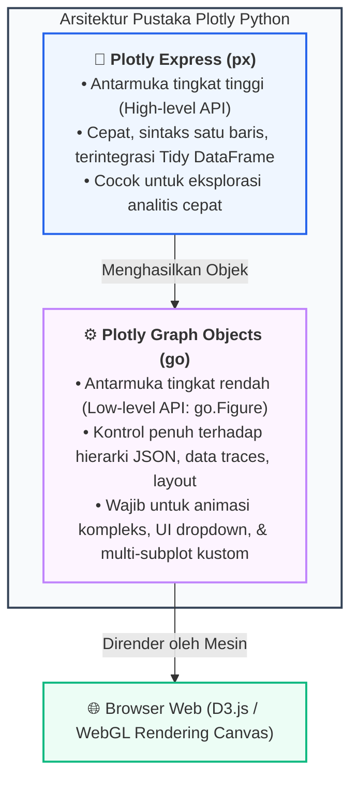

# 📘 Modul 09: Visualisasi Interaktif & Web-Ready dengan Plotly

## 🎯 Capaian Pembelajaran (Sub-CPMK 3)
Setelah mempelajari modul ini, mahasiswa diharapkan mampu:
1. Memahami arsitektur pustaka **Plotly** serta membedakan antara antarmuka **Plotly Express (`px`)** dan **Plotly Graph Objects (`go`)**.
2. Merancang kustomisasi interaksi pengguna: *Custom Hover Tooltips* (`hovertemplate`), Zoom, Pan, dan Seleksi Data.
3. Membangun visualisasi dinamis berbasis waktu (*Temporal Animation*) dengan slider dan tombol pemutar otomatis (*Hans Rosling Style*).
4. Mengintegrasikan komponen UI internal Plotly: **Dropdown Menus (`updatemenus`)**, **Range Sliders**, dan **Range Selectors**.
5. Membangun dashboard multi-subplot interaktif dan mengekspornya ke format HTML mandiri (*standalone web-ready*).

---

## 1. Arsitektur Pustaka Plotly: Express vs Graph Objects

Plotly merender grafik interaktif berbasis teknologi web standar (**D3.js** dan **WebGL**). Setiap objek grafik pada dasarnya adalah struktur data pohon kamus JSON (*JSON Tree Specification*).



---

## 2. Fitur Interaktivitas Web-Ready Kunci

1. **Custom Hover Tooltip (`hovertemplate`):** Mengganti informasi bawaan dengan template teks berformat HTML tebal, warna, dan pemformatan angka/mata uang profesional.
2. **Temporal Animation:** Menganimasikan evolusi data dari tahun ke tahun secara mulus menggunakan interpolasi koordinat.
3. **In-Chart UI Controls (`updatemenus`):** Menambahkan tombol dropdown atau toggle button di dalam canvas grafik tanpa membutuhkan server backend tambahan.

---

## 3. Implementasi Kode Hands-on Python Plotly

Berikut adalah 3 eksperimen interaktif lengkap yang dapat langsung dijalankan dan diekspor ke file `.html`:

```python
import plotly.express as px
import plotly.graph_objects as go
from plotly.subplots import make_subplots
import pandas as pd
import numpy as np

# ==============================================================================
# PRAKTIKUM 1: ANIMASI TEMPORAL 4D (HANS ROSLING GAPMINDER STYLE)
# ==============================================================================
# Memuat Dataset Global Gapminder
df_gapminder = px.data.gapminder()

fig_bubble = px.scatter(
    df_gapminder,
    x="gdpPercap",
    y="lifeExp",
    animation_frame="year",        # Sumbu Waktu Slider Animasi
    animation_group="country",      # Konsistensi Objek Antar Frame
    size="pop",                     # Ukuran Lingkaran (Populasi)
    color="continent",              # Warna Berdasarkan Benua
    hover_name="country",           # Nama Negara pada Hover Header
    log_x=True,                     # Skala Logaritmik Sumbu X
    size_max=60,
    range_x=[100, 100000],
    range_y=[25, 90],
    labels={
        "gdpPercap": "PDB Per Kapita (USD - Skala Log)",
        "lifeExp": "Angka Harapan Hidup (Tahun)",
        "pop": "Jumlah Populasi",
        "continent": "Benua"
    },
    title="Evolusi PDB vs Angka Harapan Hidup Global (1952–2007)"
)

# Kustomisasi Layout & Tooltip
fig_bubble.update_layout(
    template="plotly_white",
    title_font=dict(size=16, color="#0f172a", family="Arial"),
    hoverlabel=dict(bgcolor="white", font_size=12, font_family="Arial")
)

# Simpan ke Berkas HTML Interaktif
fig_bubble.write_html("gapminder_animated.html")
print("✅ Berkas 'gapminder_animated.html' berhasil disimpan.")
# fig_bubble.show()

# ==============================================================================
# PRAKTIKUM 2: DASHBOARD MULTI-SUBPLOT INTERAKTIF DENGAN HOVERTEMPLATE KUSTOM
# ==============================================================================
np.random.seed(42)
dates = pd.date_range("2024-01-01", periods=100)
df_finance = pd.DataFrame({
    "Tanggal": dates,
    "Harga_Saham": 1500 + np.cumsum(np.random.randn(100)*15),
    "Volume_Transaksi": np.random.randint(50000, 200000, size=100)
})

# Inisialisasi Subplot 2 Baris x 1 Kolom dengan Skala Sumbu Bersama
fig_sub = make_subplots(rows=2, cols=1, shared_xaxes=True,
                        vertical_spacing=0.08,
                        subplot_titles=("Tren Harga Saham Harian (IDR)", "Volume Transaksi Pasar"),
                        row_heights=[0.7, 0.3])

# Trace 1: Line Plot Harga dengan Custom Hovertemplate
fig_sub.add_trace(
    go.Scatter(
        x=df_finance["Tanggal"],
        y=df_finance["Harga_Saham"],
        mode="lines",
        name="Harga Saham",
        line=dict(color="#0284c7", width=2.5),
        hovertemplate="<b>Tanggal:</b> %{x|%d %b %Y}<br><b>Harga:</b> Rp %{y:,.2f}<extra></extra>"
    ),
    row=1, col=1
)

# Trace 2: Bar Plot Volume
fig_sub.add_trace(
    go.Bar(
        x=df_finance["Tanggal"],
        y=df_finance["Volume_Transaksi"],
        name="Volume",
        marker_color="#94a3b8",
        hovertemplate="<b>Volume:</b> %{y:,.0f} Lembar<extra></extra>"
    ),
    row=2, col=1
)

# Kustomisasi Layout & Range Selector
fig_sub.update_layout(
    template="plotly_white",
    height=550,
    showlegend=False,
    title_text="Dashboard Analisis Performa Saham & Likuiditas Pasar"
)
fig_sub.write_html("stock_dashboard.html")
print("✅ Berkas 'stock_dashboard.html' berhasil disimpan.")

# ==============================================================================
# PRAKTIKUM 3: KONTROL UI DROPDOWN MENUS (UPDATEMENUS) TANPA SERVER
# ==============================================================================
df_sales = pd.DataFrame({
    'Bulan': ['Jan', 'Feb', 'Mar', 'Apr', 'Mei', 'Jun'],
    'Pendapatan': [120, 150, 140, 180, 210, 240], # Juta Rp
    'Jumlah_Order': [450, 520, 490, 610, 730, 800],
    'Pelanggan_Baru': [80, 95, 88, 120, 145, 170]
})

fig_dropdown = go.Figure()

# Tambahkan 3 Traces (Awalnya hanya trace 1 yang visible)
fig_dropdown.add_trace(go.Bar(x=df_sales['Bulan'], y=df_sales['Pendapatan'], name='Pendapatan', marker_color='#2563eb', visible=True))
fig_dropdown.add_trace(go.Bar(x=df_sales['Bulan'], y=df_sales['Jumlah_Order'], name='Jumlah Order', marker_color='#10b981', visible=False))
fig_dropdown.add_trace(go.Bar(x=df_sales['Bulan'], y=df_sales['Pelanggan_Baru'], name='Pelanggan Baru', marker_color='#f59e0b', visible=False))

# Buat Dropdown Menu Interaktif
fig_dropdown.update_layout(
    updatemenus=[
        dict(
            active=0,
            buttons=list([
                dict(label="Total Pendapatan (Juta Rp)",
                     method="update",
                     args=[{"visible": [True, False, False]},
                           {"title": "Analisis Metrik: Total Pendapatan Bulanan", "yaxis": {"title": "Juta Rupiah"}}]),
                dict(label="Total Jumlah Order",
                     method="update",
                     args=[{"visible": [False, True, False]},
                           {"title": "Analisis Metrik: Jumlah Order Transaksi", "yaxis": {"title": "Jumlah Transaksi"}}]),
                dict(label="Pelanggan Baru",
                     method="update",
                     args=[{"visible": [False, False, True]},
                           {"title": "Analisis Metrik: Akusisi Pelanggan Baru", "yaxis": {"title": "Jumlah User"}}]),
            ]),
            direction="down",
            pad={"r": 10, "t": 10},
            showactive=True,
            x=0.0,
            xanchor="left",
            y=1.2,
            yanchor="top"
        ),
    ],
    template="plotly_white",
    title="Analisis Kinerja Bisnis Bulanan Dinamis"
)

fig_dropdown.write_html("dropdown_metric_selector.html")
print("✅ Berkas 'dropdown_metric_selector.html' berhasil disimpan.")
```

---

## 4. Rangkuman & Latihan Mandiri

::: tip 💡 Rangkuman Konsep Kunci
1. **Plotly Express vs Graph Objects:** Gunakan `px` untuk pembuatan chart eksploratif cepat, dan beralihlah ke `go.Figure` untuk menambahkan kontrol UI internal, multiple traces, atau animasi kustom.
2. **Bebas Overplotting:** Pemanfaatan interaktivitas *Zoom* dan *Box Select* menyelesaikan masalah penumpukan titik data ribuan baris tanpa perlu mengurangi integritas data.
3. **HTML Mandiri:** Output Plotly dapat diekspor menggunakan `fig.write_html()` yang menghasilkan berkas HTML mandiri (*standalone*) dengan pustaka JS terintegrasi di dalamnya sehingga dapat dibuka di komputer mana pun tanpa instalasi Python.
:::

### 📝 Tugas Praktikum 8 (Mandiri)
1. **Pembangunan Visualisasi Animasi Mandiri:** Buatlah sebuah animasi scatter plot interaktif menggunakan data indikator kesehatan dunia (Gapminder atau data BPS) yang menampilkan pergerakan Angka Harapan Hidup terhadap Tingkat Kelahiran Kasar (*Crude Birth Rate*) dari tahun ke tahun.
2. **Kustomisasi UI Dropdown:** Buat grafik garis interaktif dengan Plotly yang memiliki tombol dropdown untuk mengubah palet warna tema (*Light*, *Dark*, dan *Colorblind-safe Viridis*) secara langsung pada antarmuka web.