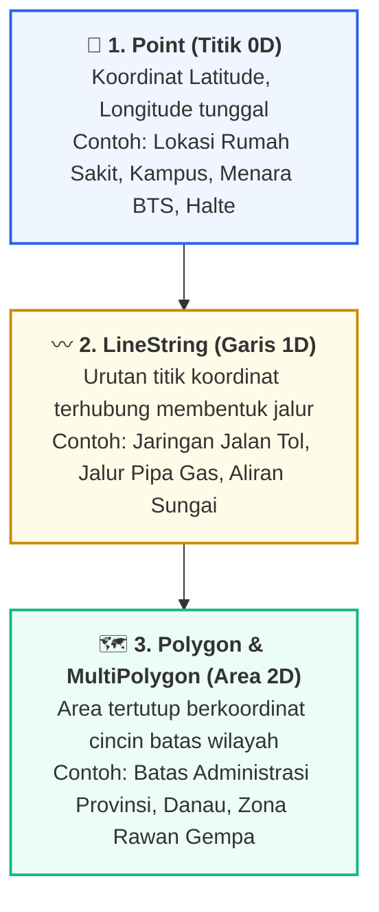
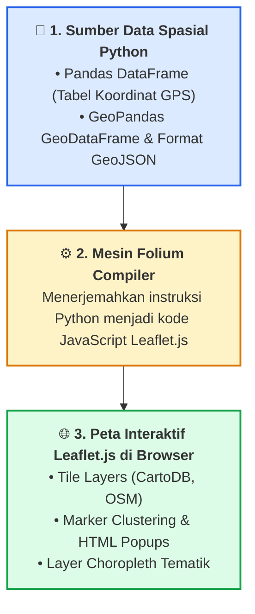

# 📘 Modul 10: Visualisasi Data Geospasial & Pemetaan Wilayah

## 🎯 Capaian Pembelajaran (Sub-CPMK 3)
Setelah mempelajari modul ini, mahasiswa diharapkan mampu:
1. Memahami konsep dasar data geospasial: Sistem Referensi Koordinat (**WGS84 / EPSG:4326** vs **EPSG:3857**), geometri vektor (*Point, LineString, Polygon*), dan format standar **GeoJSON**.
2. Membangun peta interaktif berbasis web menggunakan pustaka **Folium** (wrapper Python untuk Leaflet.js).
3. Menerapkan fitur **Marker Clustering**, HTML Popups, dan **HeatMap Kepadatan Spasial**.
4. Merancang dan mempublikasikan **Peta Choropleth** tematik wilayah yang menghubungkan data statistik dengan batas wilayah administratif.
5. Menggunakan **GeoPandas** untuk manipulasi dan analisis data geospasial tabular.

---

## 1. Fondasi Data Geospasial & Sistem Koordinat

Data geospasial adalah data yang mengaitkan suatu informasi atribut dengan posisi geografis tertentu di permukaan bumi:



### Sistem Referensi Koordinat (Coordinate Reference System - CRS)
1. **Geographic CRS (WGS84 / EPSG:4326):** Menggunakan satuan derajat sudut desimal (latitude −90° s.d. +90°, longitude −180° s.d. +180°). Merupakan standar baku sensor GPS dan format berkas GeoJSON.
2. **Projected CRS (Web Mercator / EPSG:3857):** Memproyeksikan bola bumi ke bidang datar 2D dalam satuan meter. Digunakan oleh mesin tile peta web seperti OpenStreetMap, Google Maps, dan Leaflet.

---

## 2. Arsitektur Pustaka Folium & Leaflet.js

Folium menggabungkan kemudahan manipulasi data Python dengan kekuatan rendering visual peta interaktif **Leaflet.js**:



---

## 3. Implementasi Kode Hands-on Python Folium

Berikut adalah 3 skrip mandiri untuk membuat peta interaktif lengkap dengan Marker Clustering, HeatMap kepadatan spasial, dan Peta Choropleth:

```python
import folium
from folium.plugins import MarkerCluster, HeatMap, MiniMap
import pandas as pd
import numpy as np
import json

# ==============================================================================
# PRAKTIKUM 1: PETA INTERAKTIF FASKES & KAMPUS (MARKER CLUSTERING & HTML POPUP)
# ==============================================================================
# Koordinat Pusat: Kota Banda Aceh (5.5483° N, 95.3238° E)
peta_aceh = folium.Map(
    location=[5.5483, 95.3238],
    zoom_start=13,
    tiles="CartoDB positron" # Basemap minimalis elegan
)

# Dataset Fasilitas Publik (Simulasi Koordinat Nyata)
data_lokasi = [
    {"nama": "Universitas Ubudiyah Indonesia (UUI)", "lat": 5.5501, "lon": 95.3190, "kategori": "Kampus", "status": "Aktif", "icon": "graduation-cap", "color": "purple"},
    {"nama": "RSUD Dr. Zainoel Abidin", "lat": 5.5686, "lon": 95.3402, "kategori": "Rumah Sakit", "status": "Rujukan Utama", "icon": "plus", "color": "red"},
    {"nama": "RS Ibu dan Anak Aceh", "lat": 5.5612, "lon": 95.3345, "kategori": "Rumah Sakit", "status": "Khusus", "icon": "plus", "color": "red"},
    {"nama": "Masjid Raya Baiturrahman", "lat": 5.5536, "lon": 95.3197, "kategori": "Cagar Budaya", "status": "Pusat Landmark", "icon": "star", "color": "green"},
    {"nama": "Museum Tsunami Aceh", "lat": 5.5480, "lon": 95.3148, "kategori": "Edukasi", "status": "Monumen Sejarah", "icon": "info-sign", "color": "blue"}
]

# Gunakan MarkerCluster untuk menangani kumpulan titik padat
cluster = MarkerCluster(name="Fasilitas Publik Aceh").add_to(peta_aceh)

for item in data_lokasi:
    # Buat Konten Popup dengan Format HTML Tabel Rapi
    popup_html = f"""
    <div style="font-family: Arial, sans-serif; width: 200px;">
        <h4 style="margin: 0 0 5px 0; color: #1e293b;">{item['nama']}</h4>
        <hr style="margin: 3px 0 8px 0; border: 0.5px solid #cbd5e1;">
        <table style="width: 100%; font-size: 12px;">
            <tr><td><b>Kategori:</b></td><td>{item['kategori']}</td></tr>
            <tr><td><b>Status:</b></td><td><span style="color: #0284c7; font-weight: bold;">{item['status']}</span></td></tr>
        </table>
    </div>
    """
    
    folium.Marker(
        location=[item["lat"], item["lon"]],
        popup=folium.Popup(popup_html, max_width=250),
        tooltip=item["nama"],
        icon=folium.Icon(color=item["color"], icon=item["icon"], prefix="fa" if item["icon"] == "graduation-cap" else "glyphicon")
    ).add_to(cluster)

# Tambahkan Plugin MiniMap di Pojok Bawah
MiniMap(toggle_display=True).add_to(peta_aceh)
folium.LayerControl().add_to(peta_aceh)

peta_aceh.save("peta_fasilitas_aceh.html")
print("✅ Berkas 'peta_fasilitas_aceh.html' berhasil disimpan.")

# ==============================================================================
# PRAKTIKUM 2: PETA KEPADATAN SPASIAL (SPATIAL HEATMAP)
# ==============================================================================
# Simulasi 300 Titik Insiden Lalu Lintas / Permintaan Layanan
np.random.seed(42)
lat_pusat, lon_pusat = 5.5536, 95.3197
lats = lat_pusat + np.random.normal(0, 0.02, 300)
lons = lon_pusat + np.random.normal(0, 0.02, 300)
bobot_kejadian = np.random.uniform(0.5, 2.0, 300) # Bobot intensitas

peta_heat = folium.Map(location=[lat_pusat, lon_pusat], zoom_start=12, tiles="CartoDB dark_matter")

# Siapkan list data koordinat [lat, lon, weight]
heat_data = [[lat, lon, weight] for lat, lon, weight in zip(lats, lons, bobot_kejadian)]

HeatMap(
    heat_data,
    radius=14,
    blur=18,
    max_zoom=14,
    gradient={0.2: '#2563eb', 0.5: '#10b981', 0.8: '#f59e0b', 1.0: '#ef4444'}
).add_to(peta_heat)

peta_heat.save("peta_heatmap_kepadatan.html")
print("✅ Berkas 'peta_heatmap_kepadatan.html' berhasil disimpan.")

# ==============================================================================
# PRAKTIKUM 3: PETA CHOROPLETH TEMATIK WILAYAH DENGAN GEOJSON
# ==============================================================================
# GeoJSON Sederhana untuk 3 Wilayah Simulasi (Aceh, Sumut, Sumbar)
geojson_wilayah = {
    "type": "FeatureCollection",
    "features": [
        {
            "type": "Feature",
            "id": "AC",
            "properties": {"name": "Aceh"},
            "geometry": {"type": "Polygon", "coordinates": [[[95.0, 5.0], [97.5, 5.0], [97.5, 2.0], [95.0, 2.0], [95.0, 5.0]]]}
        },
        {
            "type": "Feature",
            "id": "SU",
            "properties": {"name": "Sumatera Utara"},
            "geometry": {"type": "Polygon", "coordinates": [[[97.5, 4.0], [100.0, 4.0], [100.0, 0.5], [97.5, 0.5], [97.5, 4.0]]]}
        },
        {
            "type": "Feature",
            "id": "SB",
            "properties": {"name": "Sumatera Barat"},
            "geometry": {"type": "Polygon", "coordinates": [[[98.5, 0.5], [101.5, 0.5], [101.5, -2.0], [98.5, -2.0], [98.5, 0.5]]]}
        }
    ]
}

# Data Statistik Indeks Pembangunan Manusia (IPM)
df_ipm = pd.DataFrame({
    'Kode_Provinsi': ['AC', 'SU', 'SB'],
    'Provinsi': ['Aceh', 'Sumatera Utara', 'Sumatera Barat'],
    'Skor_IPM': [72.8, 73.5, 73.2]
})

peta_choropleth = folium.Map(location=[2.0, 98.0], zoom_start=6, tiles="CartoDB positron")

folium.Choropleth(
    geo_data=geojson_wilayah,
    name="Indeks Pembangunan Manusia (IPM)",
    data=df_ipm,
    columns=["Kode_Provinsi", "Skor_IPM"],
    key_on="feature.id",
    fill_color="YlGnBu",
    fill_opacity=0.7,
    line_opacity=0.3,
    legend_name="Skor Indeks Pembangunan Manusia (IPM)"
).add_to(peta_choropleth)

folium.LayerControl().add_to(peta_choropleth)
peta_choropleth.save("peta_choropleth_ipm.html")
print("✅ Berkas 'peta_choropleth_ipm.html' berhasil disimpan.")
```

---

## 4. Rangkuman & Latihan Mandiri

::: tip 💡 Rangkuman Konsep Kunci
1. **Sistem Koordinat WGS84:** Selalu pastikan koordinat lintang (*Latitude*) dan bujur (*Longitude*) berformat desimal EPSG:4326 sebelum dimasukkan ke Folium.
2. **Marker Clustering:** Gunakan `MarkerCluster` jika Anda memiliki lebih dari 50 titik lokasi agar performa browser tidak lambat dan peta tidak penuh sesak.
3. **Peta Choropleth:** Kunci keberhasilan peta choropleth terletak pada kecocokan nilai (*exact match*) antara kolom identitas pada DataFrame dengan `key_on` pada berkas GeoJSON.
:::

### 📝 Tugas Praktikum 9 (Mandiri)
1. **Pemetaan Sebaran Sekolah/Fasilitas:** Kumpulkan data koordinat GPS (Latitude dan Longitude) dari minimal 10 fasilitas umum di kota domisili Anda. Buat peta interaktif Folium dengan ikon penanda yang berbeda untuk tiap kategori (Pendidikan, Kesehatan, Transportasi) dan sertakan informasi jam operasional pada HTML Popup.
2. **Eksplorasi GeoPandas:** Unduh berkas GeoJSON resmi batas kabupaten/kota di Provinsi Aceh (dari geoportal Ina-Geoportal / Satu Data Indonesia), lakukan penggabungan (*merge*) dengan data statistik jumlah penduduk, dan buatlah Peta Choropleth interaktif menggunakan Folium.