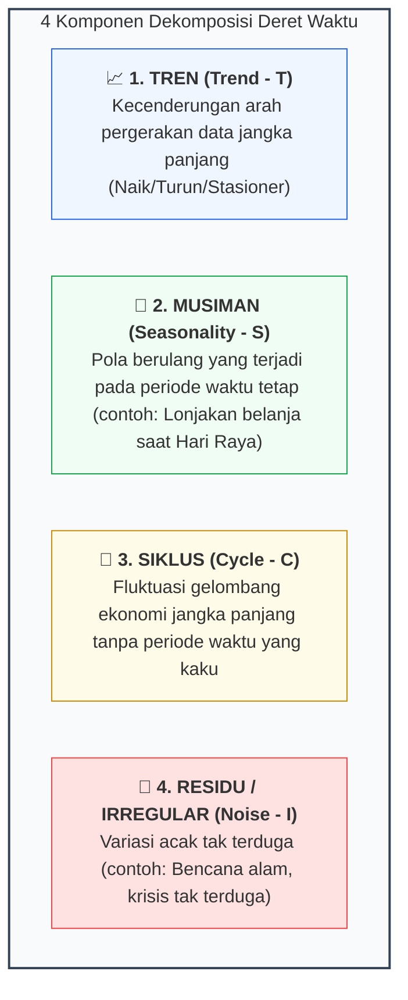
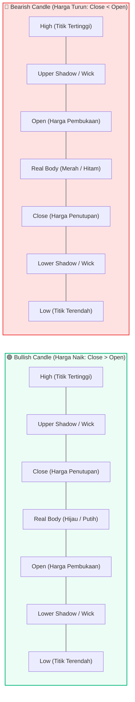

# 📘 Modul 11: Visualisasi Data Deret Waktu (Time Series) & Finansial

## 🎯 Capaian Pembelajaran (Sub-CPMK 3)
Setelah mempelajari modul ini, mahasiswa diharapkan mampu:
1. Memahami 4 komponen fundamental data deret waktu: **Tren (*Trend*)**, **Musiman (*Seasonality*)**, **Siklus (*Cycle*)**, dan **Residu (*Residual/Noise*)**.
2. Melakukan manipulasi indeks temporal (resampling harian/bulanan) dan teknik pemulusan data (*Data Smoothing*) menggunakan **Moving Average (SMA & EMA)**.
3. Melakukan dan menginterpretasikan visualisasi dekomposisi deret waktu (Aditif vs Multiplikatif) menggunakan pustaka **Statsmodels**.
4. Membangun visualisasi finansial pasar modal profesional: **Candlestick Chart (OHLC)** dan **Volume Subplot** berbasis **Plotly**.
5. Mengidentifikasi pola musiman (*Seasonal Subseries Plot*) dan autokorelasi (ACF).

---

## 1. Empat Komponen Fundamental Data Deret Waktu

Data deret waktu (*time series*) adalah urutan pengamatan yang dicatat secara kronologis pada interval waktu yang seragam:



### Model Matematis Dekomposisi:
1. **Model Aditif:** Digunakan jika magnitudo variasi musiman relatif konstan terhadap perubahan tren:
   $$Y_t = T_t + S_t + C_t + I_t$$
2. **Model Multiplikatif:** Digunakan jika amplitudo variasi musiman membesar seiring meningkatnya nilai tren:
   $$Y_t = T_t \times S_t \times C_t \times I_t$$

---

## 2. Anatomi Grafik Candlestick Finansial (OHLC)

Grafik Candlestick meringkas 4 titik harga aset finansial dalam satu batang waktu (*Open, High, Low, Close*):



---

## 3. Implementasi Kode Hands-on Python

Berikut adalah 3 skrip mandiri untuk analisis tren pemulusan (*moving average*), dekomposisi musiman dengan *Statsmodels*, dan Candlestick chart interaktif:

```python
import pandas as pd
import numpy as np
import matplotlib.pyplot as plt
from statsmodels.tsa.seasonal import seasonal_decompose
import plotly.graph_objects as go
from plotly.subplots import make_subplots

plt.rcParams['figure.dpi'] = 200

# ==============================================================================
# PRAKTIKUM 1: PEMULUSAN DATA (MOVING AVERAGE & CONFIDENCE BANDS)
# ==============================================================================
# Generate Data Sensor IoT Harian (365 Hari dengan Noise & Tren)
np.random.seed(42)
tanggal = pd.date_range(start="2024-01-01", periods=365, freq="D")
tren = np.linspace(20, 35, 365)
musiman = 5 * np.sin(2 * np.pi * np.arange(365) / 30) # Siklus bulanan
noise = np.random.normal(0, 2.5, 365)
suhu_harian = tren + musiman + noise

df_sensor = pd.DataFrame({"Tanggal": tanggal, "Suhu": suhu_harian}).set_index("Tanggal")

# Hitung 7-Day & 30-Day Moving Average
df_sensor['SMA_7'] = df_sensor['Suhu'].rolling(window=7, center=True).mean()
df_sensor['SMA_30'] = df_sensor['Suhu'].rolling(window=30, center=True).mean()
df_sensor['STD_30'] = df_sensor['Suhu'].rolling(window=30, center=True).std()

fig, ax = plt.subplots(figsize=(11, 5))

# Plot Data Mentah (Transparan)
ax.plot(df_sensor.index, df_sensor['Suhu'], color='#cbd5e1', linewidth=1, alpha=0.7, label='Data Mentah Harian')

# Plot SMA 7 & SMA 30
ax.plot(df_sensor.index, df_sensor['SMA_7'], color='#38bdf8', linewidth=1.5, label='Pemulusan 7-Hari (SMA 7)')
ax.plot(df_sensor.index, df_sensor['SMA_30'], color='#0284c7', linewidth=2.5, label='Tren Utama 30-Hari (SMA 30)')

# Shaded Area ± 1 Std Deviasi dari SMA 30
ax.fill_between(df_sensor.index, df_sensor['SMA_30'] - df_sensor['STD_30'], 
                df_sensor['SMA_30'] + df_sensor['STD_30'], color='#0284c7', alpha=0.15, label='Pita Volatilitas (±1σ)')

ax.set_title("Analisis Deret Waktu Suhu Sensor IoT dengan Pemulusan Moving Average", fontsize=12, fontweight='bold', pad=15, loc='left')
ax.set_ylabel("Suhu Ruang (°C)", fontweight='medium')
ax.spines['top'].set_visible(False)
ax.spines['right'].set_visible(False)
ax.legend(frameon=False, loc='upper left')
ax.grid(axis='y', linestyle=':', alpha=0.6)

plt.tight_layout()
plt.show()

# ==============================================================================
# PRAKTIKUM 2: DEKOMPOSISI 4 KOMPONEN TIME SERIES (STATSMODELS)
# ==============================================================================
# Resample ke mingguan untuk dekomposisi musiman yang stabil (Periode 52 Minggu)
df_weekly = df_sensor['Suhu'].resample('W').mean().interpolate()
hasil_dekomposisi = seasonal_decompose(df_weekly, model='additive', period=4) # Periode 4 minggu (bulanan)

fig, axes = plt.subplots(4, 1, figsize=(10, 8), sharex=True)

axes[0].plot(hasil_dekomposisi.observed, color='#0f172a', linewidth=1.5)
axes[0].set_ylabel('Observed', fontweight='bold')

axes[1].plot(hasil_dekomposisi.trend, color='#0284c7', linewidth=2)
axes[1].set_ylabel('Trend', fontweight='bold')

axes[2].plot(hasil_dekomposisi.seasonal, color='#10b981', linewidth=1.5)
axes[2].set_ylabel('Seasonal', fontweight='bold')

axes[3].scatter(hasil_dekomposisi.resid.index, hasil_dekomposisi.resid, color='#ef4444', s=15, alpha=0.8)
axes[3].axhline(0, color='gray', linestyle='--', linewidth=1)
axes[3].set_ylabel('Residual', fontweight='bold')

for ax in axes:
    ax.spines['top'].set_visible(False)
    ax.spines['right'].set_visible(False)
    ax.grid(axis='y', linestyle=':', alpha=0.4)

plt.suptitle("Dekomposisi Aditif Komponen Deret Waktu Sensor IoT", fontsize=13, fontweight='bold', y=0.98)
plt.tight_layout()
plt.show()

# ==============================================================================
# PRAKTIKUM 3: CANDLESTICK CHART FINANSIAL INTERAKTIF & VOLUME (PLOTLY)
# ==============================================================================
# Simulasi Data Pasar Saham Harian 60 Hari
np.random.seed(10)
dates_stock = pd.date_range("2024-01-01", periods=60, freq="B") # Business days
base_price = 1000 + np.cumsum(np.random.randn(60)*10)
open_p = base_price + np.random.uniform(-5, 5, 60)
close_p = open_p + np.random.uniform(-15, 15, 60)
high_p = np.maximum(open_p, close_p) + np.random.uniform(2, 10, 60)
low_p = np.minimum(open_p, close_p) - np.random.uniform(2, 10, 60)
volume = np.random.randint(100000, 800000, size=60)

df_saham = pd.DataFrame({
    'Tanggal': dates_stock, 'Open': open_p, 'High': high_p,
    'Low': low_p, 'Close': close_p, 'Volume': volume
})
df_saham['MA20'] = df_saham['Close'].rolling(window=20).mean()

# Buat Subplot 2 Panel (Candlestick di atas, Volume di bawah)
fig_stock = make_subplots(rows=2, cols=1, shared_xaxes=True,
                          vertical_spacing=0.05,
                          subplot_titles=("Pergerakan Harga Saham (Candlestick & MA20)", "Volume Transaksi Harian"),
                          row_heights=[0.75, 0.25])

# Panel 1: Candlestick & Garis MA20
fig_stock.add_trace(
    go.Candlestick(
        x=df_saham['Tanggal'],
        open=df_saham['Open'], high=df_saham['High'],
        low=df_saham['Low'], close=df_saham['Close'],
        increasing_line_color='#10b981', decreasing_line_color='#ef4444',
        name="OHLC"
    ), row=1, col=1
)
fig_stock.add_trace(
    go.Scatter(x=df_saham['Tanggal'], y=df_saham['MA20'], name="MA20", line=dict(color="#f59e0b", width=1.8)),
    row=1, col=1
)

# Panel 2: Bar Volume
colors_volume = ['#10b981' if c >= o else '#ef4444' for o, c in zip(df_saham['Open'], df_saham['Close'])]
fig_stock.add_trace(
    go.Bar(x=df_saham['Tanggal'], y=df_saham['Volume'], marker_color=colors_volume, name="Volume"),
    row=2, col=1
)

fig_stock.update_layout(
    template="plotly_white",
    xaxis_rangeslider_visible=False,
    height=600,
    title="Dashboard Analitik Finansial Candlestick Saham"
)

fig_stock.write_html("candlestick_stock.html")
print("✅ Berkas 'candlestick_stock.html' berhasil disimpan.")
```

---

## 4. Rangkuman & Latihan Mandiri

::: tip 💡 Rangkuman Konsep Kunci
1. **Pemisahan Sinyal & Derau (*Signal vs Noise*):** Gunakan teknik *Moving Average* untuk menyaring fluktuasi jangka pendek dan menonjolkan arah tren jangka panjang.
2. **Model Dekomposisi:** Gunakan model *Additive* jika variasi musiman bersifat stabil, dan gunakan model *Multiplicative* jika fluktuasi persentase musiman berbanding lurus dengan skala harga.
3. **Candlestick OHLC:** Memberikan gambaran volatilitas intraday yang jauh lebih kaya dibanding grafik garis harga penutupan biasa (*Close line*).
:::

### 📝 Tugas Praktikum 10 (Mandiri)
1. **Analisis Musiman Bulanan:** Ambil dataset penjualan e-commerce atau data penerbangan maskapai. Lakukan dekomposisi deret waktu menggunakan `statsmodels.tsa.seasonal.seasonal_decompose` dan tentukan pada bulan apa terjadi lonjakan musiman tertinggi (*Peak Season*).
2. **Kustomisasi Indikator Finansial:** Modifikasi grafik Candlestick Plotly di atas dengan menambahkan indikator **Bollinger Bands** (Garis Rata-rata SMA 20 ditambah dan dikurang $2 \times \text{Standar Deviasi}$).