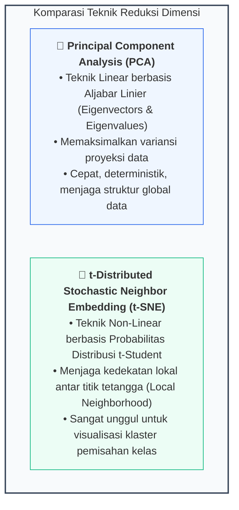
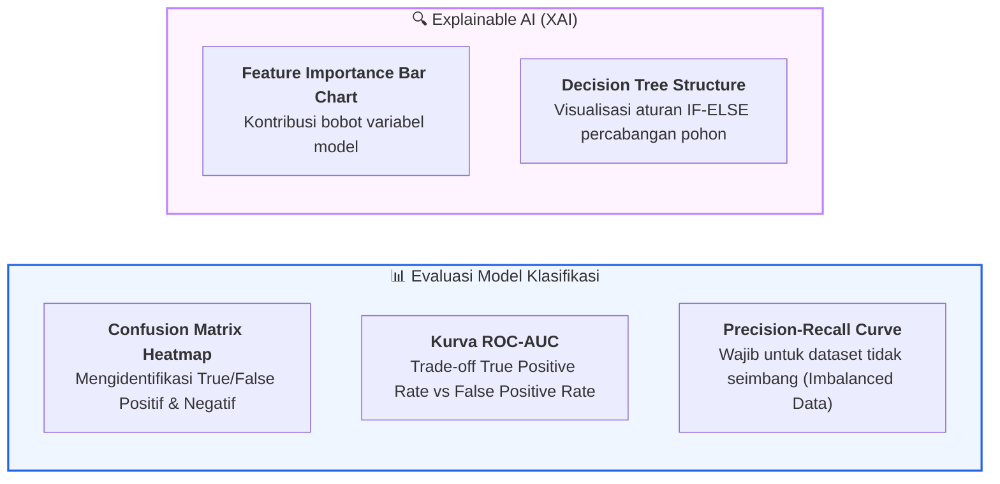

# 📘 Modul 12: Visualisasi Model AI, Machine Learning & Reduksi Dimensi

## 🎯 Capaian Pembelajaran (Sub-CPMK 4)
Setelah mempelajari modul ini, mahasiswa diharapkan mampu:
1. Memvisualisasikan dataset berdimensi tinggi (*High-Dimensional Data*) ke dalam ruang 2D dan 3D menggunakan teknik **Principal Component Analysis (PCA)** dan **t-SNE**.
2. Mengevaluasi performa model klasifikasi Machine Learning melalui visualisasi: **Confusion Matrix Beranotasi**, **Kurva ROC-AUC**, dan **Precision-Recall Curve**.
3. Menganalisis sisaan model regresi (*Residual Analysis*) untuk mendeteksi *Heteroscedasticity*.
4. Memvisualisasikan arsitektur model pohon keputusan (**Decision Tree**) dan signifikansi fitur (**Feature Importance**).
5. Mengimplementasikan konsep keterjelasan kecerdasan buatan (*Explainable AI - XAI*).

---

## 1. Reduksi Dimensi: Teori PCA vs t-SNE

Dataset Machine Learning di dunia nyata sering kali memiliki puluhan hingga ribuan variabel (*curse of dimensionality*). Reduksi dimensi memproyeksikan data ke ruang 2D/3D tanpa kehilangan informasi krusial:



---

## 2. Visualisasi Evaluasi Model Machine Learning



---

## 3. Implementasi Kode Hands-on Python Scikit-Learn

Berikut adalah 3 eksperimen Python mandiri untuk reduksi dimensi, evaluasi model klasifikasi, dan visualisasi pohon keputusan:

```python
import matplotlib.pyplot as plt
import seaborn as sns
import numpy as np
import pandas as pd
import plotly.express as px

from sklearn.datasets import load_wine, load_breast_cancer
from sklearn.model_selection import train_test_split
from sklearn.preprocessing import StandardScaler
from sklearn.decomposition import PCA
from sklearn.ensemble import RandomForestClassifier
from sklearn.tree import DecisionTreeClassifier, plot_tree
from sklearn.metrics import confusion_matrix, roc_curve, auc

plt.rcParams['figure.dpi'] = 200

# ==============================================================================
# PRAKTIKUM 1: REDUKSI DIMENSI PCA 2D & 3D INTERAKTIF (PLOTLY)
# ==============================================================================
# Memuat Dataset Wine (13 Fitur Kimiawi, 3 Kelas Target)
data_wine = load_wine()
X_wine = data_wine.data
y_wine = data_wine.target
target_names = data_wine.target_names

# Standarisasi Fitur (Wajib sebelum PCA)
X_scaled = StandardScaler().fit_transform(X_wine)

# Reduksi menjadi 3 Komponen Utama (PC1, PC2, PC3)
pca = PCA(n_components=3)
X_pca = pca.fit_transform(X_scaled)
var_ratio = pca.explained_variance_ratio_

df_pca = pd.DataFrame(X_pca, columns=['PC1', 'PC2', 'PC3'])
df_pca['Kelas_Kultivar'] = [target_names[i] for i in y_wine]

print(f"Variansi Terjelaskan PC1: {var_ratio[0]*100:.1f}% | PC2: {var_ratio[1]*100:.1f}% | PC3: {var_ratio[2]*100:.1f}%")
print(f"Total Informasi Terwakili: {sum(var_ratio)*100:.1f}%\n")

# Scatter 2D dengan Plotly Express
fig_pca = px.scatter(
    df_pca, x='PC1', y='PC2', color='Kelas_Kultivar',
    title=f'Visualisasi Ruang Fitur PCA Dataset Wine (Variansi Total: {sum(var_ratio[:2])*100:.1f}%)',
    labels={'PC1': f'Komponen Utama 1 ({var_ratio[0]*100:.1f}%)',
            'PC2': f'Komponen Utama 2 ({var_ratio[1]*100:.1f}%)'},
    template='plotly_white'
)
fig_pca.write_html("pca_wine_2d.html")
print("✅ Berkas 'pca_wine_2d.html' berhasil disimpan.")

# ==============================================================================
# PRAKTIKUM 2: CONFUSION MATRIX BERANOTASI & KURVA ROC-AUC (EVALUASI MODEL)
# ==============================================================================
# Memuat Dataset Kanker Payudara (Biner: Malignant vs Benign)
cancer = load_breast_cancer()
X_train, X_test, y_train, y_test = train_test_split(cancer.data, cancer.target, test_size=0.3, random_state=42, stratify=cancer.target)

# Training Model Random Forest
rf_model = RandomForestClassifier(n_estimators=100, random_state=42)
rf_model.fit(X_train, y_train)

y_pred = rf_model.predict(X_test)
y_prob = rf_model.predict_proba(X_test)[:, 1]

fig, axes = plt.subplots(1, 2, figsize=(12, 5))

# Panel 1: Confusion Matrix Beranotasi Persentase & Jumlah Absolut
cm = confusion_matrix(y_test, y_pred)
cm_norm = cm.astype('float') / cm.sum(axis=1)[:, np.newaxis] # Normalisasi baris

labels = np.asarray([f"{val}\n({pct:.1%})" for val, pct in zip(cm.flatten(), cm_norm.flatten())]).reshape(2, 2)
sns.heatmap(cm, annot=labels, fmt="", cmap="Blues", cbar=False,
            xticklabels=cancer.target_names, yticklabels=cancer.target_names, ax=axes[0])
axes[0].set_title("A. Confusion Matrix (Jumlah & Akurasi)", fontsize=11, fontweight='bold')
axes[0].set_xlabel("Prediksi Model")
axes[0].set_ylabel("Kelas Aktual")

# Panel 2: Kurva ROC-AUC
fpr, tpr, thresholds = roc_curve(y_test, y_prob)
roc_auc = auc(fpr, tpr)

axes[1].plot(fpr, tpr, color='#0284c7', linewidth=2.5, label=f'Random Forest (AUC = {roc_auc:.3f})')
axes[1].plot([0, 1], [0, 1], color='#94a3b8', linestyle='--', label='Klasifikasi Acak (AUC = 0.500)')
axes[1].set_title("B. Receiver Operating Characteristic (ROC Curve)", fontsize=11, fontweight='bold')
axes[1].set_xlabel("False Positive Rate (FPR)")
axes[1].set_ylabel("True Positive Rate (TPR)")
axes[1].legend(loc='lower right', frameon=False)
axes[1].spines['top'].set_visible(False)
axes[1].spines['right'].set_visible(False)
axes[1].grid(axis='both', linestyle=':', alpha=0.5)

plt.tight_layout()
plt.show()

# ==============================================================================
# PRAKTIKUM 3: VISUALISASI POHON KEPUTUSAN & FEATURE IMPORTANCE
# ==============================================================================
fig, axes = plt.subplots(1, 2, figsize=(14, 5.5))

# Subplot 1: Feature Importance Terurut
importances = rf_model.feature_importances_
indices = np.argsort(importances)[-8:] # Ambil 8 fitur teratas

axes[0].barh(range(len(indices)), importances[indices], color='#0d9488', height=0.6)
axes[0].set_yticks(range(len(indices)))
axes[0].set_yticklabels([cancer.feature_names[i] for i in indices], fontsize=10)
axes[0].set_title("Top 8 Fitur Paling Berpengaruh (Feature Importance)", fontsize=11, fontweight='bold', loc='left')
axes[0].set_xlabel("Nilai Signifikansi Gini Importance")
axes[0].spines['top'].set_visible(False)
axes[0].spines['right'].set_visible(False)

# Subplot 2: Pohon Keputusan Sederhana (Depth = 2)
dt_small = DecisionTreeClassifier(max_depth=2, random_state=42)
dt_small.fit(X_train, y_train)

plot_tree(dt_small, feature_names=cancer.feature_names, class_names=cancer.target_names,
          filled=True, rounded=True, fontsize=8.5, ax=axes[1])
axes[1].set_title("Visualisasi Struktur Aturan Pohon Keputusan (Depth=2)", fontsize=11, fontweight='bold')

plt.tight_layout()
plt.show()
```

---

## 4. Rangkuman & Latihan Mandiri

::: tip 💡 Rangkuman Konsep Kunci
1. **Standarisasi Sebelum PCA:** Selalu lakukan penskalaan fitur (`StandardScaler`) sebelum reduksi dimensi agar variabel dengan rentang angka besar tidak mendominasi komponen utama secara tidak adil.
2. **Interpretasi Confusion Matrix:** Jangan hanya melihat akurasi global; evaluasi tingkat *False Negatives* (kanker tak terdeteksi) yang berisiko fatal.
3. **ROC-AUC vs Precision-Recall:** Gunakan kurva ROC-AUC untuk dataset seimbang, dan gunakan kurva *Precision-Recall* apabila dataset mengalami ketimpangan kelas yang parah (*imbalanced classification*).
:::

### 📝 Tugas Praktikum 11 (Mandiri)
1. **Eksplorasi Reduksi Dimensi t-SNE:** Gunakan `sklearn.manifold.TSNE` untuk memproyeksikan dataset `load_digits()` (gambar tulisan tangan angka 0-9) ke dalam ruang 2D. Analisis bagaimana klaster tiap angka terpisah secara visual.
2. **Visualisasi Regresi & Analisis Sisaan (*Residual Plot*):** Latih model regresi linear pada dataset perumahan (atau `load_diabetes`). Buat grafik *Scatter Plot* antara nilai prediksi terhadap sisaan eror (*Residuals*) dan evaluasi apakah asumsi homoskedastisitas terpenuhi.