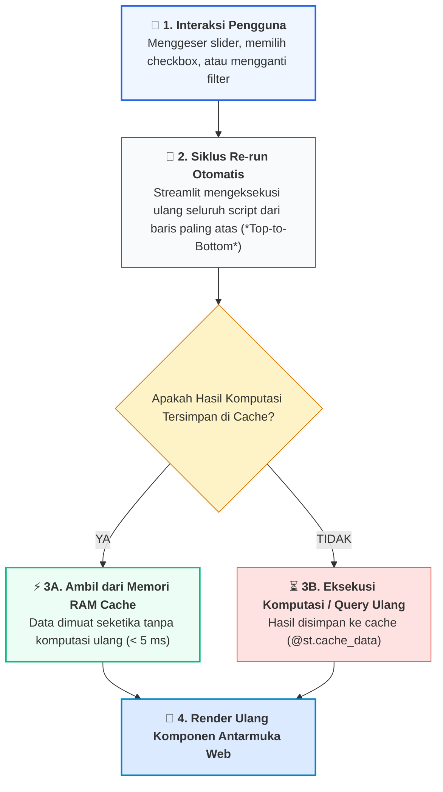
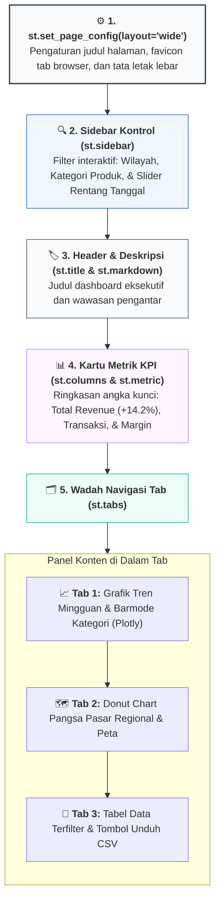

# 📘 Modul 13: Pembangunan Dashboard Analitik Interaktif dengan Streamlit

## 🎯 Capaian Pembelajaran (Sub-CPMK 3)
Setelah mempelajari modul ini, mahasiswa diharapkan mampu:
1. Memahami arsitektur eksekusi reaktif (*Top-to-Bottom Execution Model*) dan pengelolaan status (**Session State**) pada framework **Streamlit**.
2. Mengoptimalkan kecepatan muat aplikasi menggunakan dekorator caching data (**`@st.cache_data`** dan **`@st.cache_resource`**).
3. Merancang tata letak antarmuka web modern: `st.sidebar`, `st.columns`, `st.tabs`, `st.expander`, dan kartu ringkasan metrik **`st.metric`**.
4. Mengintegrasikan komponen grafik interaktif Plotly, peta Folium, dan tabel dinamis ke dalam aplikasi web.
5. Membangun dan menjalankan aplikasi dashboard analitik bisnis mandiri (`app.py`) yang responsif dan siap dideploy.

---

## 1. Arsitektur Reaktif Streamlit & Manajemen Memori Caching

Streamlit merevolusi pengembangan antarmuka data dengan memungkinkan pembuatan web apps murni menggunakan kode Python tanpa membutuhkan HTML, CSS, atau JavaScript tingkat lanjut:



### Dua Jenis Caching Streamlit:
1. **`@st.cache_data`:** Digunakan untuk fungsi yang mengembalikan objek data serializable (misal: Pandas DataFrame, kalkulasi NumPy, data JSON, pemrosesan teks). Cache akan otomatis diperbarui jika parameter fungsi berubah.
2. **`@st.cache_resource`:** Digunakan untuk objek non-serializable yang persisten lintas sesi (misal: koneksi database PostgreSQL/MySQL, sesi model Machine Learning Scikit-Learn/TensorFlow).

---

## 2. Struktur Tata Letak Aplikasi Profesional



---

## 3. Implementasi Kode Lengkap Aplikasi Dashboard (`app.py`)

Simpan kode di bawah ini ke dalam sebuah file bernama `app.py` dan jalankan melalui terminal dengan perintah: `streamlit run app.py`.

```python
import streamlit as st
import pandas as pd
import numpy as np
import plotly.express as px

# ==============================================================================
# 1. KONFIGURASI HALAMAN APLIKASI
# ==============================================================================
st.set_page_config(
    page_title="Executive Sales & BI Dashboard",
    page_icon="📊",
    layout="wide",
    initial_sidebar_state="expanded"
)

# ==============================================================================
# 2. GENERASI DATA DENGAN CACHING (@st.cache_data)
# ==============================================================================
@st.cache_data
def load_sales_dataset():
    np.random.seed(42)
    n_rows = 500
    dates = pd.date_range(start="2024-01-01", end="2024-06-30", periods=n_rows)
    cities = np.random.choice(["Banda Aceh", "Medan", "Padang", "Pekanbaru", "Batam"], size=n_rows)
    categories = np.random.choice(["Enterprise Server", "Cloud Software", "Hardware IT", "Consulting"], size=n_rows, p=[0.2, 0.4, 0.25, 0.15])
    revenue = np.random.exponential(scale=15000000, size=n_rows) + 5000000
    units = np.random.randint(1, 10, size=n_rows)
    
    df = pd.DataFrame({
        "Tanggal": dates,
        "Kota": cities,
        "Kategori": categories,
        "Pendapatan_IDR": revenue,
        "Jumlah_Unit": units
    })
    df["Bulan"] = df["Tanggal"].dt.strftime("%b %Y")
    return df

df_master = load_sales_dataset()

# ==============================================================================
# 3. SIDEBAR: FILTER KONTROL INTERAKTIF
# ==============================================================================
st.sidebar.header("🔍 Filter Analisis Bisnis")
st.sidebar.markdown("Pilih parameter di bawah untuk memfilter data secara dinamis:")

# Filter Kota (Multiselect)
selected_cities = st.sidebar.multiselect(
    "Pilih Wilayah / Kota:",
    options=df_master["Kota"].unique(),
    default=df_master["Kota"].unique()
)

# Filter Kategori Produk
selected_categories = st.sidebar.multiselect(
    "Pilih Kategori Produk:",
    options=df_master["Kategori"].unique(),
    default=df_master["Kategori"].unique()
)

# Filter Rentang Tanggal
min_date = df_master["Tanggal"].min().date()
max_date = df_master["Tanggal"].max().date()
date_range = st.sidebar.date_input("Rentang Tanggal:", value=[min_date, max_date], min_value=min_date, max_value=max_date)

# Terapkan Filter
if len(date_range) == 2:
    start_d, end_d = date_range
    df_filtered = df_master[
        (df_master["Kota"].isin(selected_cities)) &
        (df_master["Kategori"].isin(selected_categories)) &
        (df_master["Tanggal"].dt.date >= start_d) &
        (df_master["Tanggal"].dt.date <= end_d)
    ]
else:
    df_filtered = df_master

# ==============================================================================
# 4. KANVAS UTAMA: HEADER & KARTU METRIK KPI (st.metric)
# ==============================================================================
st.title("📊 Executive Business Intelligence Dashboard")
st.markdown(f"Menampilkan analitik performa penjualan regional dari **{len(df_filtered):,}** transaksi terfilter.")

col1, col2, col3, col4 = st.columns(4)

total_rev = df_filtered["Pendapatan_IDR"].sum()
avg_trx = df_filtered["Pendapatan_IDR"].mean() if len(df_filtered) > 0 else 0
total_units = df_filtered["Jumlah_Unit"].sum()

col1.metric(label="Total Pendapatan", value=f"Rp {total_rev/1e9:.2f} M", delta="+14.2% YoY")
col2.metric(label="Total Transaksi", value=f"{len(df_filtered):,} TRX", delta="+5.8%")
col3.metric(label="Rata-rata Nilai Order", value=f"Rp {avg_trx/1e6:.1f} Jt", delta="-2.1%")
col4.metric(label="Total Unit Terjual", value=f"{total_units:,} Pcs", delta="+8.5%")

st.divider()

# ==============================================================================
# 5. TABS VISUALISASI INTERAKTIF & TABEL
# ==============================================================================
tab1, tab2, tab3 = st.tabs(["📈 Tren & Kategori", "🗺️ Kontribusi Wilayah", "📑 Eksplorasi Data Tabular"])

with tab1:
    col_chart1, col_chart2 = st.columns([1.2, 1])
    
    with col_chart1:
        # Line Plot Tren Harian Agregat
        df_trend = df_filtered.set_index("Tanggal").resample("W")["Pendapatan_IDR"].sum().reset_index()
        fig_trend = px.line(
            df_trend, x="Tanggal", y="Pendapatan_IDR",
            title="Tren Pendapatan Mingguan (Juta IDR)",
            markers=True, template="plotly_white",
            color_discrete_sequence=["#0284c7"]
        )
        st.plotly_chart(fig_trend, use_container_width=True)
        
    with col_chart2:
        # Grouped Bar Plot Kategori
        fig_cat = px.bar(
            df_filtered.groupby(["Kategori", "Kota"])["Pendapatan_IDR"].sum().reset_index(),
            x="Kategori", y="Pendapatan_IDR", color="Kota", barmode="group",
            title="Pendapatan per Kategori Produk & Kota",
            template="plotly_white"
        )
        st.plotly_chart(fig_cat, use_container_width=True)

with tab2:
    # Donut Chart Pangsa Pasar Regional
    fig_donut = px.pie(
        df_filtered, names="Kota", values="Pendapatan_IDR", hole=0.45,
        title="Pangsa Pasar Regional Berdasarkan Pendapatan",
        template="plotly_white",
        color_discrete_sequence=px.colors.qualitative.Prism
    )
    st.plotly_chart(fig_donut, use_container_width=True)

with tab3:
    st.markdown("### 📑 Data Tabular Terfilter")
    st.dataframe(df_filtered, use_container_width=True, height=280)
    
    # Tombol Unduh CSV
    csv_data = df_filtered.to_csv(index=False).encode('utf-8')
    st.download_button(
        label="📥 Download Data Terfilter (.CSV)",
        data=csv_data,
        file_name="sales_data_terfilter.csv",
        mime="text/csv"
    )
```

---

## 4. Cara Menjalankan & Mempublikasikan Aplikasi

1. **Jalankan Secara Lokal:**
   ```bash
   streamlit run app.py
   ```
2. **Deploy ke Streamlit Community Cloud (Gratis):**
   - Dorong (*push*) berkas kode ke repositori GitHub publik Anda.
   - Buat berkas `requirements.txt` yang memuat pustaka:
     ```text
     streamlit>=1.30.0
     pandas>=2.0.0
     numpy>=1.24.0
     plotly>=5.18.0
     ```
   - Masuk ke [share.streamlit.io](https://share.streamlit.io), hubungkan akun GitHub Anda, pilih repositori, dan klik **Deploy**.

---

## 5. Rangkuman & Latihan Mandiri

::: tip 💡 Rangkuman Konsep Kunci
1. **Model Top-to-Bottom:** Setiap perubahan widget menjalankan ulang seluruh script. Selalu gunakan `@st.cache_data` pada fungsi pemrosesan data berat untuk menjaga responsivitas UI.
2. **Struktur Tata Letak:** Tempatkan filter di `st.sidebar`, KPI kunci di `st.metric` baris atas, dan bagi visualisasi ke dalam `st.tabs` tematik.
3. **Download Button:** Sediakan tombol `st.download_button` agar pengguna bisnis dapat mengekspor hasil filter data ke CSV/Excel secara mandiri.
:::

### 📝 Tugas Praktikum 12 (Mandiri)
1. **Pembuatan Multi-Page App:** Buat struktur direktori proyek Streamlit dengan folder `pages/` yang memuat 2 halaman terpisah:
   - `pages/1_📊_Analitik_Penjualan.py` (Visualisasi performa keuangan & tren).
   - `pages/2_🗺️_Peta_Geospasial.py` (Peta persebaran pelanggan menggunakan Folium/Streamlit-Folium).
2. **Integrasi Model Machine Learning:** Buat antarmuka Streamlit sederhana yang memuat model klasifikasi (dari Modul 12), menyediakan input form slider untuk fitur-fitur bunga iris/kanker, dan menampilkan hasil prediksi kelas secara real-time.