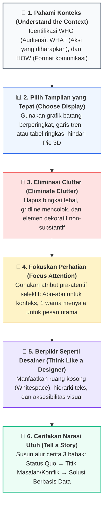
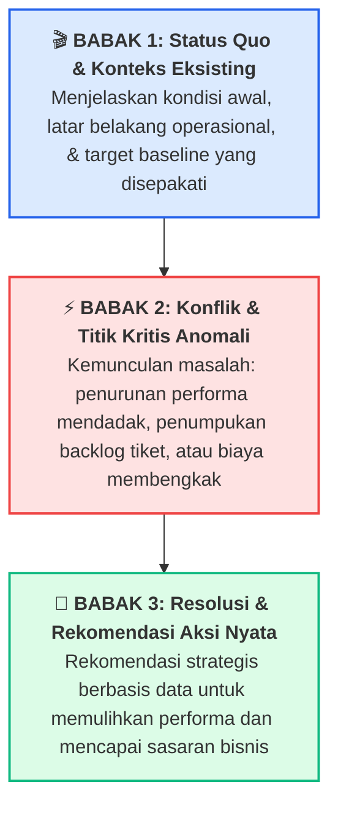

# 📘 Modul 14: Seni Data Storytelling & Komunikasi Bisnis Efektif

## 🎯 Capaian Pembelajaran (Sub-CPMK 4)
Setelah mempelajari modul ini, mahasiswa diharapkan mampu:
1. Memahami dan mengaplikasikan kerangka kerja 6 langkah **Storytelling with Data (Cole Nussbaumer Knaflic)**.
2. Merumuskan **The 3-Minute Story** dan **The Big Idea** untuk mengarahkan pesan utama kepada pengambil keputusan.
3. Mengeliminasi kekacauan visual (*Visual Clutter*) secara sistematis untuk meminimalkan beban kognitif audiens.
4. Menerapkan teknik penekanan selektif (*Selective Preattentive Focus*) menggunakan skema palet **Abu-abu Netral + 1 Warna Aksen**.
5. Menyusun struktur naratif 3 babak (*Konteks → Konflik → Resolusi*) dan mengimplementasikan transformasi grafik *Before vs After* menggunakan Python Matplotlib.

---

## 1. Kerangka Kerja 6 Langkah Storytelling with Data

Cole Nussbaumer Knaflic (mantan People Analytics Manager di Google) merumuskan 6 pilar komunikasi visual analitis profesional:



---

## 2. Merumuskan "The Big Idea" & Narasi 3 Babak

### A. Konsep The Big Idea (1 Kalimat Inti)
"The Big Idea" merangkum pesan utama Anda ke dalam satu kalimat terstruktur yang memiliki 3 komponen:
1. **Artikulasikan sudut pandang unik Anda.**
2. **Sampaikan apa taruhannya jika tidak bertindak (*What is at stake?*).**
3. **Berikan rekomendasi tindakan nyata yang terukur.**

> 💡 **Contoh The Big Idea:**  
> *"Tingkat churn pelanggan pada kuartal ini melonjak hingga 18% akibat kendala pembayaran di aplikasi mobile, dan kita berisiko kehilangan pendapatan Rp 4,5 Miliar kecuali kita segera merilis integrasi metode pembayaran QRIS & e-Wallet instan bulan depan."*

---

### B. Struktur Narasi Data 3 Babak



---

## 3. Transformasi Kode: Before vs After Data Storytelling

Berikut adalah skrip Python mandiri yang mendemonstrasikan transformasi nyata dari grafik laporan standar yang penuh gangguan visual (*clutter*) menjadi grafik *Data Storytelling* tingkat eksekutif:

```python
import matplotlib.pyplot as plt
import numpy as np

plt.rcParams['figure.dpi'] = 200

# Data Tiket Keluhan Pelanggan TI (12 Bulan)
bulan = ['Jan', 'Feb', 'Mar', 'Apr', 'Mei', 'Jun', 'Jul', 'Agu', 'Sep', 'Okt', 'Nov', 'Des']
tiket_diterima = [160, 185, 170, 190, 210, 205, 220, 240, 290, 310, 305, 315]
tiket_selesai  = [155, 178, 168, 182, 195, 190, 180, 165, 150, 140, 135, 130] # Tim IT kewalahan sejak Agustus

# ==============================================================================
# PENDEKATAN 1: GRAFIK BEFORE (DEFAULT PENUH CLUTTER & KEKACAUAN VISUAL)
# ==============================================================================
fig, ax1 = plt.subplots(figsize=(8, 4))
ax1.plot(bulan, tiket_diterima, marker='o', label='Tiket Masuk', color='blue', linewidth=2)
ax1.plot(bulan, tiket_selesai, marker='s', label='Tiket Selesai', color='red', linewidth=2)
ax1.set_title("Grafik Tiket Helpdesk TI 2024")
ax1.set_ylabel("Jumlah Tiket")
ax1.grid(True)
ax1.legend()
plt.tight_layout()
plt.show()

# ==============================================================================
# PENDEKATAN 2: GRAFIK AFTER (DATA STORYTELLING EXECUTIVE-READY)
# ==============================================================================
fig, ax2 = plt.subplots(figsize=(11, 5.5))

# Plot Tiket Diterima (Garis Abu-abu Netral)
ax2.plot(bulan, tiket_diterima, color='#64748b', linewidth=2.5, label='Tiket Masuk')
ax2.scatter(bulan[-1], tiket_diterima[-1], color='#64748b', s=50)

# Plot Tiket Selesai (Garis Abu-abu sampai Juli, kemudian Merah Menyala sejak Agustus)
ax2.plot(bulan[:7], tiket_selesai[:7], color='#94a3b8', linewidth=2.5)
ax2.plot(bulan[6:], tiket_selesai[6:], color='#e11d48', linewidth=3.5, label='Tiket Selesai')
ax2.scatter(bulan[-1], tiket_selesai[-1], color='#e11d48', s=60)

# Direct Labeling pada Ujung Garis (Menghilangkan Legenda Terpisah)
ax2.text(11.2, tiket_diterima[-1], f"Tiket Masuk\n({tiket_diterima[-1]})", color='#334155', fontweight='bold', va='center')
ax2.text(11.2, tiket_selesai[-1], f"Tiket Selesai\n({tiket_selesai[-1]})", color='#e11d48', fontweight='bold', va='center')

# Shaded Area Menandai Periode Krisis (Agustus - Desember)
ax2.axvspan(6.5, 11.5, color='#fee2e2', alpha=0.45)
ax2.axvline(6.5, color='#e11d48', linestyle=':', linewidth=1.5)
ax2.text(6.6, 280, "2 Senior Engineer Mengundurkan Diri\nKapasitas Resolusi Anjlok 40%", 
         color='#991b1b', fontsize=9.5, fontweight='bold')

# Kustomisasi Tufte
ax2.spines['top'].set_visible(False)
ax2.spines['right'].set_visible(False)
ax2.spines['left'].set_color('#cbd5e1')
ax2.spines['bottom'].set_color('#cbd5e1')
ax2.set_xlim(-0.5, 13)
ax2.set_ylim(100, 350)
ax2.set_ylabel("Jumlah Tiket Bulanan", fontweight='medium', color='#475569')

# Judul Utama Berupa Headline Temuan Kritis (Actionable Headline)
ax2.set_title("Penumpukan Backlog Tiket IT Meningkat Sejak Agustus Akibat Kurangnya Staf", 
              fontsize=13, fontweight='bold', color='#0f172a', pad=25, loc='left')
ax2.text(-0.5, 360, "Rekomendasi: Rekrut 2 insinyur support tambahan untuk menormalkan waktu penyelesaian tiket Q1 2025.", 
         fontsize=10.5, color='#64748b')

plt.tight_layout()
plt.savefig('storytelling_helpdesk.png', dpi=300, bbox_inches='tight')
plt.show()
```

---

## 4. Rangkuman & Latihan Mandiri

::: tip 💡 Rangkuman Konsep Kunci
1. **Direct Labeling:** Tempatkan label nama seri data langsung di samping garis data, bukan di kotak legenda pojok yang memaksa mata audiens bolak-balik membaca.
2. **Action Title:** Jangan gunakan judul deskriptif pasif seperti *"Grafik Penjualan 2024"*; gunakan kalimat aktif berisi wawasan seperti *"Penjualan Wilayah Barat Tumbuh +35% Didorong Produk Cloud"*.
3. **Kekuatan Abu-Abu:** Jadikan warna abu-abu netral sebagai warna kanvas 90% elemen grafik Anda, dan gunakan 1 warna cerah kontras hanya pada bagian yang menjadi inti pembicaraan.
:::

### 📝 Tugas Praktikum 13 (Mandiri)
1. **Penyusunan The Big Idea:** Pilih salah satu topik dari: (a) Keterlambatan kelulusan skripsi mahasiswa, (b) Penurunan utilisasi lab komputer kampus, atau (c) Lonjakan transaksi kantin digital. Rumuskan *The 3-Minute Story* dan *The Big Idea* (1 kalimat) untuk dipresentasikan kepada Dekan Fakultas.
2. **Transformasi Before-After Mandiri:** Ambil grafik tabel dari skripsi/jurnal lama yang memiliki legenda membingungkan dan warna-warni berlebih. Tulis skrip Python untuk merekonstruksi grafik tersebut menjadi grafik *Data Storytelling* berstandar Cole Knaflic.