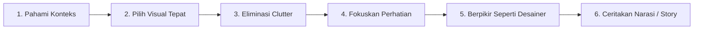

# 📘 Modul 14: Data Storytelling & Komunikasi Bisnis Efektif

## 🎯 Capaian Pembelajaran (Sub-CPMK 4)
Setelah mempelajari modul ini, mahasiswa diharapkan mampu:
1. Memahami 6 langkah kerangka kerja **Storytelling with Data (Cole Nussbaumer Knaflic)**.
2. Mengidentifikasi konteks, target audiens, dan pesan kunci (*Actionable Takeaway*).
3. Mengeliminasi kekacauan visual (*Eliminate Clutter*) untuk meminimalkan beban kognitif (*Cognitive Load*).
4. Menggunakan teknik penekanan selektif (*Selective Focus*) dan pelabelan langsung (*Direct Labeling*).

---

## 1. 6 Langkah Storytelling with Data (Cole Knaflic)

### Prinsip Utama:
1. **Pahami Konteks (*Understand the Context*):** Siapa audiens Anda? Apa yang Anda butuhkan agar mereka bertindak? (Gunakan *The 3-Minute Story* dan *The Big Idea*).
2. **Pilih Tampilan yang Tepat (*Choose an Appropriate Display*):** Jangan gunakan diagram lingkaran (*Pie Chart*) 3D jika perbandingannya lebih jelas dengan diagram batang horizontal berurut.
3. **Hilangkan Kekacauan (*Eliminate Clutter*):** Hapus border tebal, warna-warni yang tidak bermakna, dan gridline mencolok.
4. **Fokuskan Perhatian Audiens (*Focus Attention Where You Want It*):** Manfaatkan kontras warna abu-abu netral untuk seluruh elemen dasar, dan gunakan **1 warna aksen terang** (misal: Oranye/Biru) hanya pada titik data yang ingin diceritakan.
5. **Berpikir Seperti Desainer (*Think Like a Designer*):** Berikan ruang kosong (*white space*), hierarki visual yang jelas dari atas-kiri ke bawah-kanan.
6. **Ceritakan Kisah yang Utuh (*Tell a Story*):** Struktur cerita memiliki Awal (Kondisi Eksisting), Konflik/Tantangan (Anomali/Penurunan Kinerja), dan Resolusi (Solusi Berbasis Data).