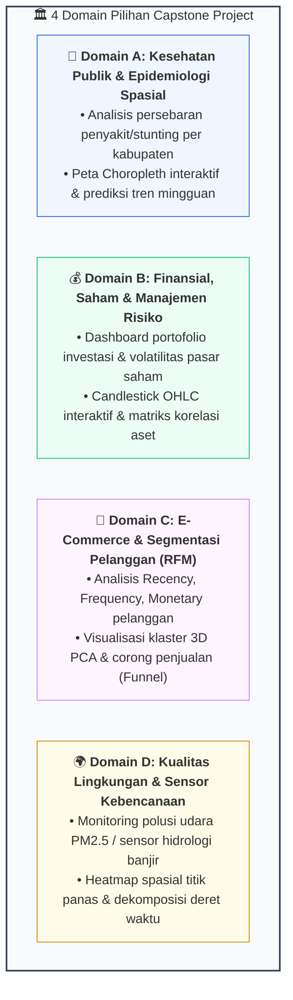
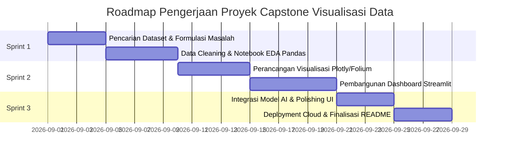

# 🚀 Modul 15: Integrasi Proyek Capstone Visualisasi Data

## 🎯 Capaian Pembelajaran (Sub-CPMK 3 & 4)
Setelah mempelajari modul ini, mahasiswa diharapkan mampu:
1. Mengintegrasikan seluruh kompetensi teori dan teknis (Modul 1 s.d. 14) ke dalam satu aplikasi dashboard analitik terpadu.
2. Memilih dan menyelesaikan persoalan data nyata dari 4 pilihan domain industri (*Kesehatan Publik, Finansial & Risiko, E-Commerce & RFM, Lingkungan & Bencana*).
3. Membangun aplikasi web dashboard multi-halaman mandiri (*Streamlit*) yang responsif, terintegrasi peta geospasial, dan model AI/ML.
4. Menerapkan standar kode bersih (*Clean Code*), arsitektur repositori modular, dan publikasi repositori GitHub profesional.

---

## 📋 Empat Pilihan Domain Studi Kasus Industri

Setiap kelompok (atau individu) wajib memilih salah satu dari 4 domain studi kasus berikut:



---

## 🏗️ Struktur Arsitektur Repositori Proyek Standar

Struktur folder proyek Capstone wajib mengikuti standar arsitektur modular berikut:

```text
capstone-dataviz-kelompokX/
├── .streamlit/
│   └── config.toml               # Konfigurasi tema warna Streamlit
├── data/
│   ├── raw/                      # Dataset mentah asli
│   └── processed/                # Dataset bersih hasil data wrangling
├── notebooks/
│   └── 01_exploratory_eda.ipynb  # Notebook analisis awal & eksperimen
├── pages/
│   ├── 1_📊_Analitik_Deskriptif.py
│   ├── 2_🗺️_Peta_Geospasial.py
│   └── 3_🤖_Prediksi_dan_Klaster_AI.py
├── src/
│   ├── __init__.py
│   ├── data_loader.py            # Modul pemuatan data & caching
│   ├── cleaning.py               # Fungsi imputasi & filter outlier
│   └── viz_helpers.py            # Template kustomisasi grafik Plotly/Matplotlib
├── app.py                        # Berkas utama Streamlit (Landing Dashboard)
├── requirements.txt              # Daftar pustaka Python yang dibutuhkan
└── README.md                     # Dokumentasi proyek, panduan instalasi, & insight
```

---

## ⏱️ Timeline Sprint Pengerjaan Proyek (3 Minggu)



---

## 📋 Checklist Kualitas Proyek (Quality Gate)

Sebelum mempresentasikan proyek pada Minggu 16 (UAS), pastikan proyek Anda memenuhi kriteria berikut:
- [ ] **Volume Data:** Dataset riil minimal **1.000+ baris data**.
- [ ] **Data-Ink Ratio:** Bebas dari elemen dekoratif tidak bermakna (*chartjunk*), sumbu diagram batang dimulai dari 0.
- [ ] **Aksesibilitas Warna:** Menggunakan palet yang aman bagi penyandang buta warna (*Colorblind Safe*).
- [ ] **Interaktivitas:** Memuat minimal 3 filter interaktif dinamis di *sidebar* yang terhubung langsung ke semua grafik.
- [ ] **Peta Geospasial:** Memuat minimal 1 layer peta Folium interaktif atau Peta Choropleth wilayah.
- [ ] **Komponen AI/ML:** Memuat visualisasi evaluasi model (*Confusion Matrix/ROC*) atau reduksi dimensi (*PCA/t-SNE*).
- [ ] **Publikasi:** Repositori GitHub publik dengan `README.md` terstruktur dan aplikasi ter-deploy di Streamlit Community Cloud.