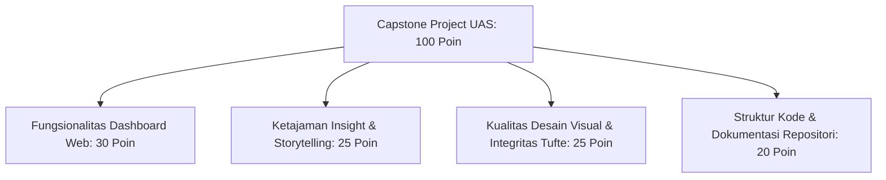

# 🎓 Modul 16: Evaluasi Akhir Semester (UAS)

## 🎯 Sasaran Evaluasi Akhir
Evaluasi Akhir Semester (UAS) merupakan puncak penilaian berbasis OBE yang menguji pencapaian menyeluruh dari **CPMK 1, CPMK 2, CPMK 3, dan CPMK 4**.

---

## 📋 Format Evaluasi UAS (Bobot: 20% dari Total Nilai Akhir)

| Komponen Asesmen | Bobot Sesi | Keterangan |
| :--- | :---: | :--- |
| **1. Demonstrasi Live Dashboard Streamlit** | **40%** | Kelancaran interaktivitas dashboard, responsivitas filter, dan visualisasi tanpa galat runtime di hadapan dosen penguji. |
| **2. Presentasi & Data Storytelling** | **30%** | Kualitas penyampaian wawasan (*insight*), penerapan etika Tufte, eliminasi clutter, dan kejelasan solusi yang ditawarkan. |
| **3. Tanya Jawab Teknis & Pertanggungjawaban Kode** | **30%** | Penguasaan kode sumber (*Python, Pandas, Plotly, Streamlit*), pemahaman arsitektur data pipeline, dan orisinalitas karya. |

---

## 🏆 Rubrik Standar Penilaian UAS Capstone UUI

