# 📊 Visualisasi Data (IFR309)

Selamat datang di portal pembelajaran resmi mata kuliah **Visualisasi Data (`IFR309`)** Program Studi S-1 Informatika, Fakultas Sains dan Teknologi, Universitas Ubudiyah Indonesia.

Mata kuliah ini dirancang dengan pendekatan **Outcome-Based Education (OBE)** untuk membekali mahasiswa dengan penguasaan teori persepsi visual manusia, prinsip desain grafis analitis, rekayasa eksplorasi data (*Exploratory Data Analysis*), pembuatan visualisasi statis dan interaktif, pemetaan geospasial, visualisasi model Machine Learning, hingga pembangunan aplikasi dashboard analitik berbasis web (*Streamlit*) dan komunikasi data bisnis (*Data Storytelling*).

---

## 🏛️ Identitas Mata Kuliah

| Komponen | Keterangan |
| :--- | :--- |
| **Kode Mata Kuliah** | `IFR309` |
| **Nama Mata Kuliah** | Visualisasi Data (*Data Visualization*) |
| **Bobot SKS** | 3 SKS (2 SKS Teori / 1 SKS Praktikum Lab) |
| **Semester / Jenjang** | Ganjil / S-1 Informatika |
| **Rumpun Mata Kuliah** | Sains Data & Informatika Cerdas |
| **Bahan Kajian (BK)** | `BK 17` (Graphics and Visualization), `BK 06` (Data and Information Management), `BK 18` (Intelligent Systems) |
| **Dosen Pengampu** | **Mahendar Dwi Payana, S.ST., M.T.** |
| **Prasyarat** | Algoritma dan Pemrograman (`IFR206`), Basis Data (`IFR222`) |

---

## 🎯 Capaian Pembelajaran Lulusan (CPL) & CPMK

### Capaian Pembelajaran Lulusan (CPL)
- **CPL01 (Pengetahuan):** Memiliki pengetahuan komprehensif tentang teori grafika, psikologi persepsi visual manusia (Gestalt), semiotika data, teori warna, dan prinsip efisiensi grafis Tufte.
- **CPL03 (Problem Solving):** Mampu merumuskan persoalan eksplorasi data, melakukan data wrangling, serta memilih representasi visual yang tepat untuk dataset dinamis.
- **CPL04 (Solusi Rekayasa Komputasi):** Mampu merancang, membangun, dan menyajikan solusi visualisasi interaktif, peta geospasial, serta dashboard analitik bisnis (*Business Intelligence*).
- **CPL05 (Inovasi Kecerdasan Artifisial):** Mampu memvisualisasikan data berdimensi tinggi (*High-Dimensional Data*) dengan teknik reduksi dimensi (PCA/t-SNE) dan visualisasi evaluasi model AI/ML.
- **CPL08 (Etika & Sikap):** Mematuhi etika integritas data visual (*Graphical Integrity*), bebas dari manipulasi bias (*Lie Factor*), dan menjunjung tinggi orisinalitas karya.

### Capaian Pembelajaran Mata Kuliah (CPMK)
1. **CPMK 1:** Menguasai teori persepsi visual, prinsip desain grafis analitis (Tufte, Gestalt, Munzner), dan semiotika visual data.
2. **CPMK 2:** Mampu mengolah, mentransformasi, dan memvisualisasikan data statistik serta distribusi menggunakan Python (Matplotlib dan Seaborn).
3. **CPMK 3:** Mampu membangun visualisasi data interaktif, eksplorasi multivariat, pemetaan geospasial, dan dashboard analitik berbasis web (Plotly, Folium, Streamlit).
4. **CPMK 4:** Mampu menyusun narasi data (*Data Storytelling*), memvisualisasikan model AI/Machine Learning, dan mempublikasikan dashboard proyek capstone terpadu.

---

## 🗺️ Peta Materi Perkuliahan 16 Minggu

```mermaid
flowchart TD
    subgraph Part1["🏛️ Bagian 1: Fondasi Teori & Persepsi"]
        M1["01. Hakikat & Sejarah Visualisasi Data"] --> M2["02. Psikologi Persepsi & Teori Gestalt"]
        M2 --> M3["03. Prinsip Desain Tufte & Framework Munzner"]
    end

    subgraph Part2["📊 Bagian 2: Data Wrangling & Visualisasi Statis"]
        M3 --> M4["04. Data Wrangling & EDA Pandas"]
        M4 --> M5["05. Matplotlib Fundamental Object-Oriented"]
        M5 --> M6["06. Seaborn Statistik & Distribusi"]
        M6 --> M7["07. Visualisasi Relasi & Multivariat"]
    end

    subgraph PartUTS["📝 Evaluasi Tengah Semester"]
        M7 --> M8{"08. Evaluasi Tengah Semester (UTS)"}
    end

    subgraph Part3["🌐 Bagian 3: Visualisasi Interaktif & Geospasial"]
        M8 --> M9["09. Visualisasi Interaktif dengan Plotly"]
        M9 --> M10["10. Pemetaan Geospasial Folium & GeoPandas"]
        M10 --> M11["11. Visualisasi Data Deret Waktu (Time Series)"]
    end

    subgraph Part4["🚀 Bagian 4: AI Viz, Dashboarding & Storytelling"]
        M11 --> M12["12. Visualisasi Model AI/ML & Reduksi Dimensi"]
        M12 --> M13["13. Pembangunan Dashboard Streamlit"]
        M13 --> M14["14. Data Storytelling & Komunikasi Bisnis"]
        M14 --> M15["15. Capstone Project Terpadu"]
        M15 --> M16{"16. Evaluasi Akhir Semester (UAS)"}
    end

    style PartUTS fill:#fef9c3,stroke:#ca8a04
    style M8 fill:#fef08a,stroke:#ca8a04,stroke-width:2px
    style M16 fill:#bbf7d0,stroke:#16a34a,stroke-width:2px
```

---

## 📚 Buku Referensi Utama

1. **Edward R. Tufte** (2001). *The Visual Display of Quantitative Information* (2nd ed.). Graphics Press.
2. **Tamara Munzner** (2014). *Visualization Analysis and Design*. CRC Press / AK Peters Visualization Series.
3. **Claus O. Wilke** (2019). *Fundamentals of Data Visualization: A Primer on Making Informative and Compelling Figures*. O'Reilly Media.
4. **Cole Nussbaumer Knaflic** (2015). *Storytelling with Data: A Data Visualization Guide for Business Professionals*. John Wiley & Sons.
5. **Colin Ware** (2020). *Information Visualization: Perception for Design* (4th ed.). Morgan Kaufmann.
6. **Wes McKinney** (2022). *Python for Data Analysis: Data Wrangling with pandas, NumPy, and Jupyter* (3rd ed.). O'Reilly Media.